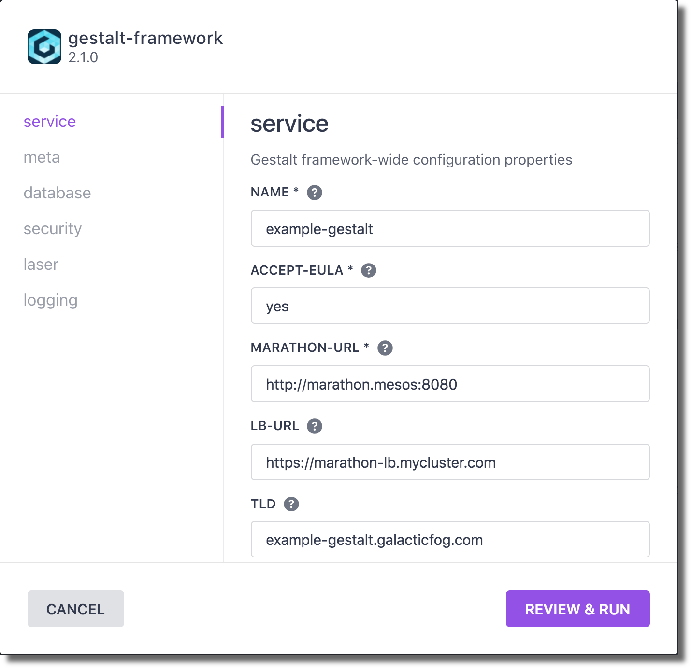
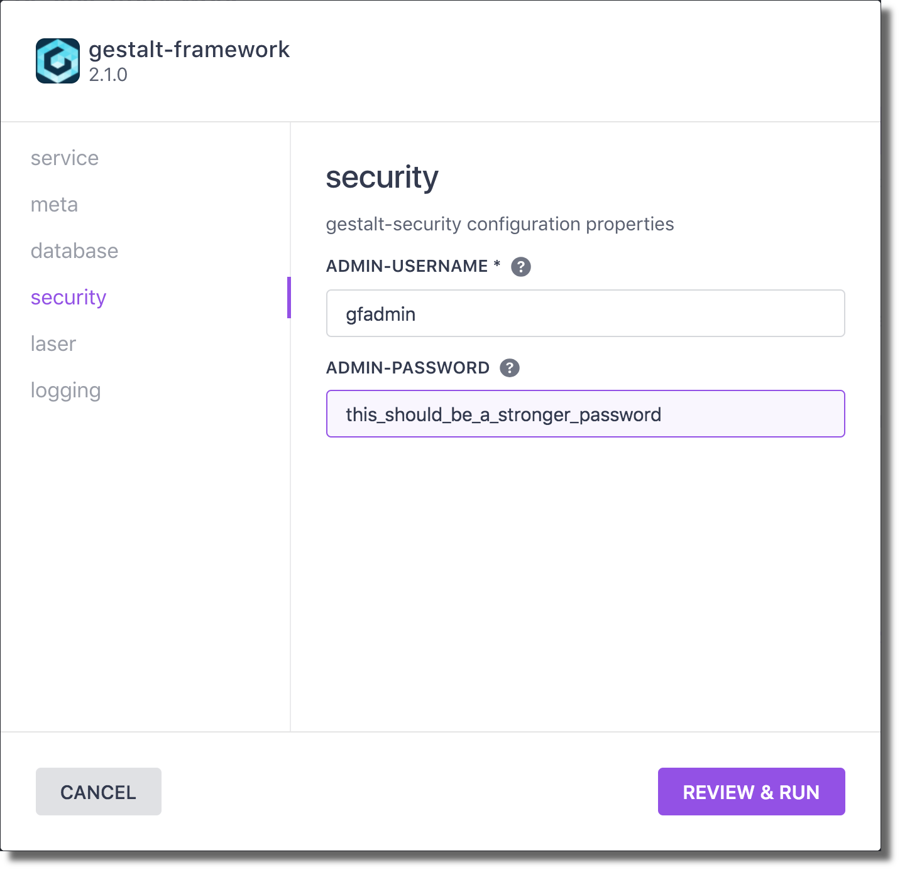
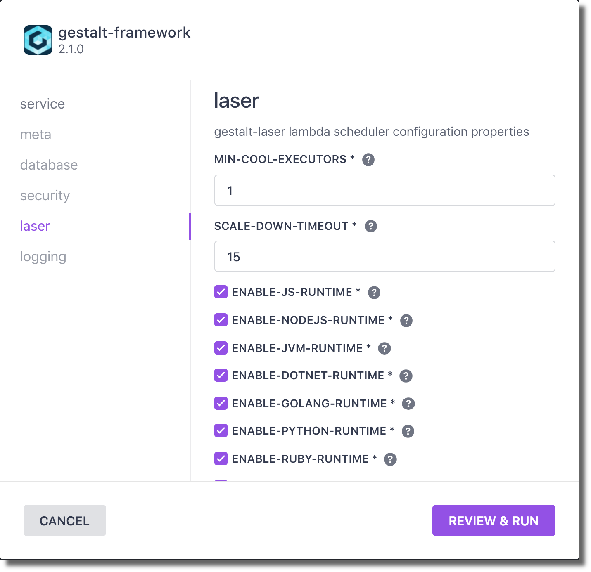
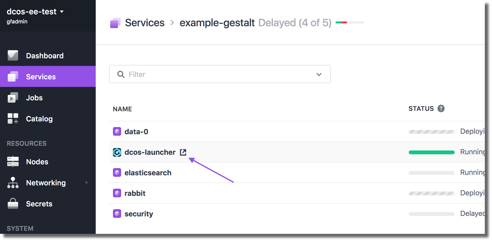
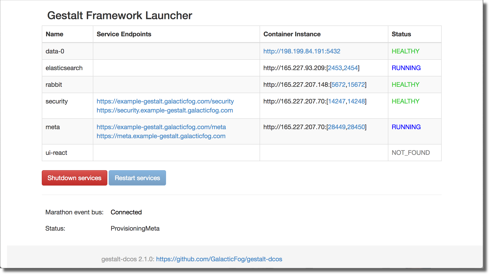
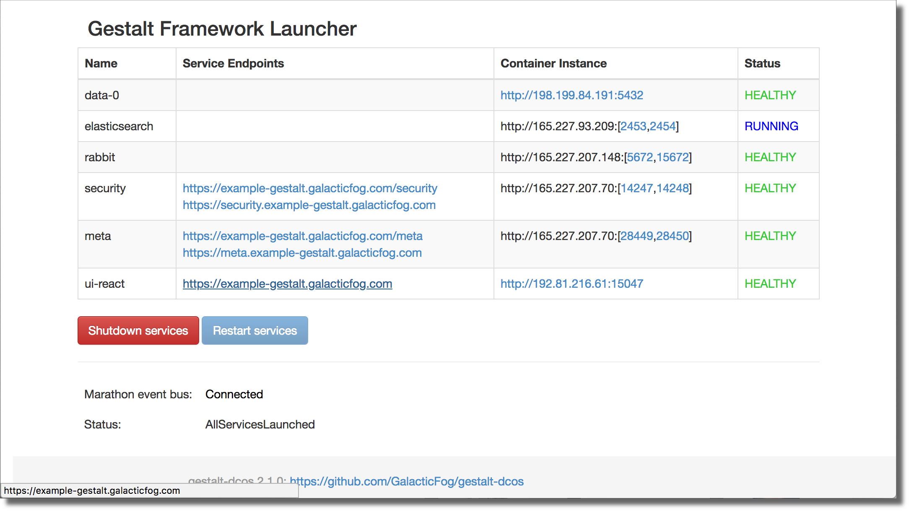

# How to use the Gestalt Framework on DC/OS

The Gestalt Framework is a set of microservices that create a platform for companies to build future-proofed cloud native applications.  The platform is comprised of three major components which include the meta service (a policy-enabled resource manager), the infrastructure layer (plug-able container and lambda engine), and the integration layer (a set of off the self microservices supporting enterprise integration).

- Estimated time for completion: 10 minutes
- Target audience: Anyone interested in running a HTTP (proxy) server
- Scope: Learn how to install NGINX on DC/OS and to serve a static website

## Installation

- Prerequisites: A running DC/OS cluster (1.10.0+)

- Recommended: marathon-lb on a public agent with a domain name redirected to the agent

### Install the Gestalt Framework from the DC/OS Universe

* In the DC/OS Universe tab, select `gestalt-framework` and click `Advanced Installation`

* Type `yes` into the `ACCEPT-EULA` box (EULA available [here](http://www.galacticfog.com/gestalt-eula.html))

* (Optional) Enter a domain name in the `TLD` box. This instructs the launcher to provision virtual hosts for the framework services.

* On the `security` tab, enter a username and strong password for the admin user. Note these for use later.

* On the `laser` tab, select the lambda runtimes that should be provisioned.

* Click `Review and install` and then `Install`

### Monitor the installation

* From the DC/OS Services tab, navigate to the application group `gestalt-framework`
* Click the URL popout next to the `dcos-launcher` task to view the launcher dashboard (this may take a minute to run and pass health checks)

* The launcher dashboard will report the convergence of the platform services as they are provisioned and initialized.

* When they are all healthy and the status is `AllServicesLaunched`, open the UI using one of the `Service Endpoints` for the `ui-react` service.

* Select one of the provided URLs for the `ui-react` service to access the Gestalt Framework UI.

## Using Gestalt

See the [Getting Started Guide](http://docs.galacticfog.com/overview/introduction/) for tips and documentation on using the Gestalt Platform.

