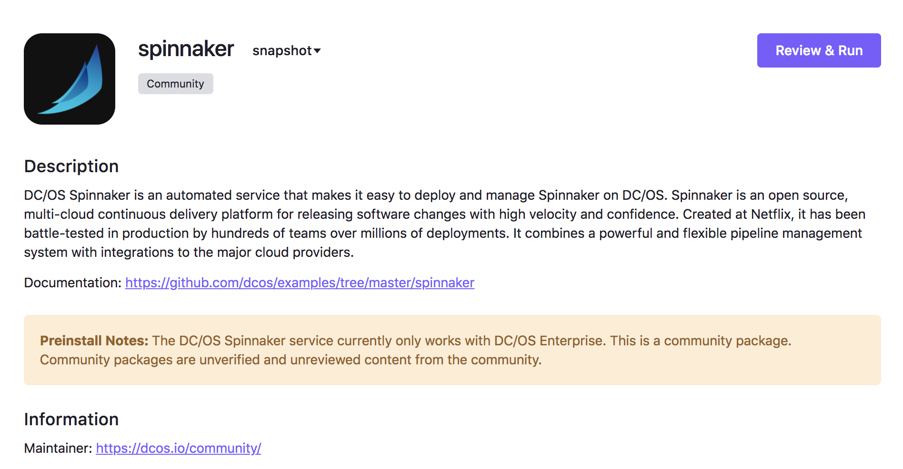
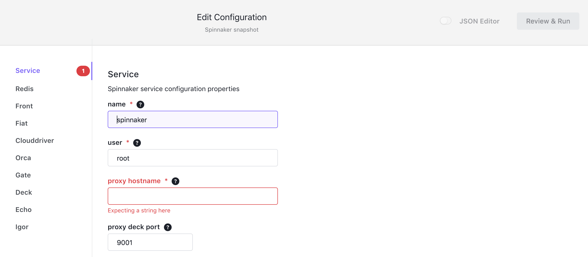
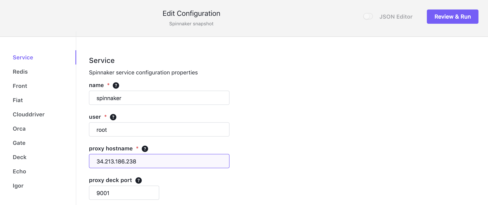
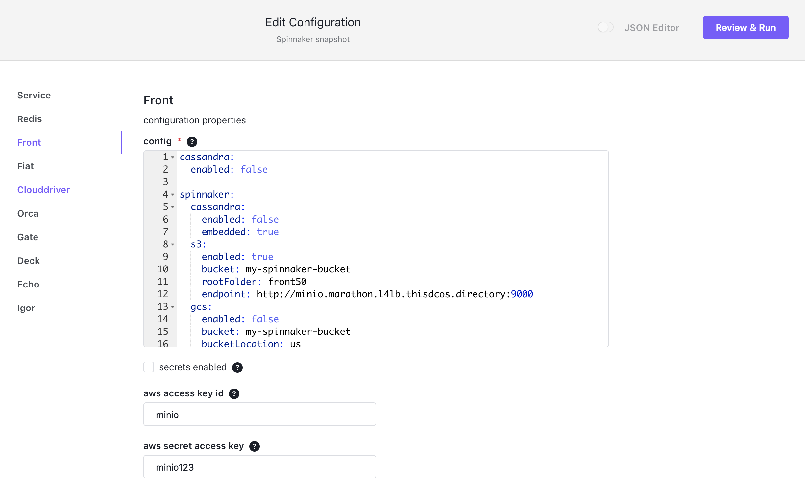

# DC/OS Spinnaker Service Guide

## Overview

DC/OS Spinnaker is an automated service that makes it easy to deploy and manage [Spinnaker](https://www.spinnaker.io/) on [DC/OS](https://mesosphere.com/product/).

Spinnaker is an open source, multi-cloud continuous delivery platform for releasing software changes with high velocity and confidence.

Created at Netflix, it has been battle-tested in production by hundreds of teams over millions of deployments. It combines a powerful and flexible pipeline management system with integrations to the major cloud providers.

The Spinnaker service is a micro service composition, a good overview on the micro services involved can be found [here](https://www.spinnaker.io/reference/architecture/).

### Note
The DC/OS Spinnaker service currently only works with **DC/OS Enterprise**. See also the [release notes](docs/RELEASE_NOTES.md).

## Install

### Quick Start
Out of the box the `DC/OS Spinnaker service` uses `minio` a s3 compatible backing store for the Spinnaker `front50` service. Use the following [minio.json](misc/minio.json) file, and run the following two commands.
```
dcos package install marathon-lb --yes
dcos marathon app add misc/minio.json
```

`marathon-lb` will make the minio console accessible via the DC/OS public agent. In your browser enter the following address. The `minio` credentials are minio / minio123.
```
http://<public-agent-ip>:9000
```

Out of the box the DC/OS `Spinnaker` service allows you to deliver to the `DC/OS cluster` the service runs itself in. The Spinnaker `deck` and `gate` services will be made available via a proxy or edge-lb running on the DC/OS clusters public agent. Note down the hostname/ip of the public agent in your DC/OS cluster


With that we are ready to install `Spinnaker`. In the DC/OS catalog/universe select Spinnaker which will show you the following. Hit *Review&Run*.



In the service section fill in the proxy hostname with the hostname of the public agent noted down earlier.



If for `minio` and `DC/OS` the default credentials are use then you are ready to go hit *Review&Run*. Otherwise the next two steps show how to configure your specific credentials.



The following dialog shows you how to configure the `minio` credentials.



The following dialog shows you how to configure the `DC/OS` credentials.


Once the service is running we launch a simple `proxy` to get access to the Spinnaker `deck` and `gate` service. Use the following [proxy.json](misc/proxy.json). For how to use edge-lb to expose these services look [here]().
```
dcos marathon app add proxy.json
```

Go to the [Using Spinnaker](#using-spinnaker) section to learn how to access the Spinnaker UI, and to get an overview of the Spinnaker concepts with samples.

### Custom Install

#### Spinnaker configuration

Use the following command to download Spinnaker configuration templates to get started.
```
curl -O https://.../spinnaker/assets/spin-config.zip && unzip spin-config.zip && cd config && chmod +x gen-configjson
```

The created *config* folder has the following yml templates.
```
front50-local.yml
clouddriver-local.yml
echo-local.yml
igor-local.yml
```

Tailor these Spinnaker yml configuration files for your specific needs. The yml can be entered via the Spinnaker configuration dialogs in the `DC/OS console` or passed in an *options.json* file on `dcos package install`.

**Note:** If you follow the links to the detailed Spinnaker configuration options you will also see the configuration of Spinnaker service dependencies. Don't worry about those configurations they are all taken care of by the DC/OS Spinnaker service.

##### [front50-local.yml](misc/config/front50-local.yml)
Front50 is the Spinnaker **persistence service**. The file shows how to configure the AWS S3 (enabled=true) and GCS (enabled=false) persistence plugin.

The DC/OS Spinnaker front50 service can be configured to use secrets for AWS S3 and GCS credentials. You have to create all of them using the following commands. **The ones you are not using with empty content.**
```
dcos security secrets create -v <your-aws-access-key-id> spinnaker/aws_access_key_id

dcos security secrets create -v <your-aws-secret-access-key> spinnaker/aws_secret_access_key

dcos security secrets create -v <your-gcp-key> spinnaker/gcp_key
```

For more configuration options see [spinnaker/front50](https://github.com/spinnaker/front50/blob/master/front50-web/config/front50.yml), and [spinnaker/spinnaker](https://github.com/spinnaker/spinnaker/blob/master/config/front50.yml).

##### [clouddriver-local.yml](misc/config/clouddriver-local.yml)
Clouddriver is the Spinnaker **cloud provider service**. The file shows how to configure the DC/OS provider plugin.

**Note:** The configured DC/OS user needs to have superuser priveledges.

For more configuration options see [spinnaker/clouddriver](https://github.com/spinnaker/clouddriver/blob/master/clouddriver-web/config/clouddriver.yml), and [spinnaker/spinnaker](https://github.com/spinnaker/spinnaker/blob/master/config/clouddriver.yml).

##### [echo-local.yml](misc/config/echo-local.yml) (optional)
Echo is the Spinnaker **notification service**. The file shows how to configure the email notification plugin.

For more configuration options see [spinnaker/echo](https://github.com/spinnaker/echo/blob/master/echo-web/config/echo.yml), and [spinnaker/spinnaker](https://github.com/spinnaker/spinnaker/blob/master/config/echo.yml).

##### [igor-local.yml](misc/config/igor-local.yml) (optional)
Igor is the Spinnaker **trigger service**. The file shows how to configure the dockerRegsitry trigger plugin.

For more configuration options see [spinnaker/igor](https://github.com/spinnaker/igor/blob/master/igor-web/config/igor.yml), and [spinnaker/spinnaker](https://github.com/spinnaker/spinnaker/blob/master/config/igor.yml).

#### DC/OS console install
When installing the Spinnaker service via the DC/OS console you have sections for each of the Spinnaker services where you can enter the respective yml configuration.

Here the sample for the clouddriver service.


#### DC/OS cli install
The config folder that got created when we dowloade the zip earlier also provides a tool that allows us to generate an *options.json* file. Once you edited the yml templates to your needs run the tool in the config folder. The proxy hostname is typically the public agent hostname.
```
./gen-optionsjson <proxy-hostname>
```

Once you have the options json you can install the Spinnaker service using the DC/OS cli.
```
dcos package install --yes spinnaker --options=options.json
```

#### edge-lb
Instead of the simple proxy we used in the quick start you can also use edge-lb. After installing edge-lb you can create the edgelb pool configuration for Spinnaker (minio is also included) using the [spinnaker-edgelb.yml](misc/spinnaker-edgelb.yml) file.
```
dcos edgelb create spinnaker-edgelb.yml
```

## Using Spinnaker

Go to your browser and enter the following url to get to the Spinnaker unser interface.

```
http://localhost:9001
```

Follow these links to learn more.
* [Spinnaker Apllications, Clusters, and Server Groups](docs/APPLICATIONS_CLUSTERS_SERVERGROUPS.md)
* [Spinnaker Pipelines](docs/PIPELINES.md)
* [DC/OS Enterprise Edge-LB](docs/EDGE_LB.md)
